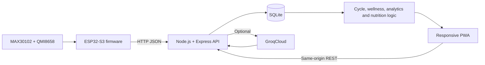

# HERA — Personal Health Companion

HERA is a wearable and web-based wellness prototype for menstrual-cycle awareness, daily self-reports, hydration guidance, sensor telemetry, analytics, notifications, and AI-assisted explanations. It combines an ESP32-S3 wrist device, a Node.js/Express API, SQLite persistence, and a responsive installable web application.

> **Safety notice:** HERA provides informational wellness support only. It does not diagnose, treat, predict fertility, assess emergencies, or replace qualified healthcare professionals.

## Overview

HERA brings wearable observations and user-entered wellness data into one dashboard:

1. MAX30102 and QMI8658 sensors collect optical and motion signals.
2. ESP32-S3 firmware derives pulse, SpO₂ estimate, wear state, movement, and activity.
3. Wearable sends JSON telemetry to the local HERA API over Wi-Fi.
4. Users record check-ins, menstrual-cycle dates, symptoms, notes, and water intake.
5. Backend stores records in SQLite and calculates cycle summaries, wellness scores, analytics, and rules-based guidance.
6. Optional Groq integration provides conversational explanations using bounded recent HERA context.



## Implemented Features

### Dashboard and wearable telemetry

- Live heart-rate and SpO₂ estimates
- Activity classification and movement level
- Wrist-wear state, device ID, and reading freshness
- Sensor-history charts
- Responsive desktop and mobile layouts

### Menstrual-cycle tracking

- Add, update, delete, and list period records
- Calendar and cycle-history views
- Cycle-day and average-cycle calculations
- Predicted period range after enough history
- Provisional phase and ovulation-window estimates

### Daily wellness check-ins

- Mood, stress, energy, sleep, and hydration scores
- Supported symptom selection
- Free-text wellness notes
- One editable record per user per day
- Daily reminder modal

### Analytics and guidance

- 7-, 30-, and 90-day analytics
- Wellness, mood, sleep, symptom, cycle, and wearable summaries
- Rules-based nutrition, hydration, and activity guidance
- Daily water tracking

### AI assistant

- Optional Groq OpenAI-compatible chat integration
- Recent HERA records used as bounded context
- Emergency-phrase interception
- Input/history limits, timeout, and assistant rate limiting
- Non-diagnostic response policy

### Notifications and profile

- In-app check-in, cycle, symptom-pattern, wearable, and signal notices
- Notification sound and local alert history
- Browser-local profile and notification preferences
- JSON export of stored check-ins, cycles, and wearable history

### Progressive Web App

- Android home-screen installation support
- Standalone display mode
- Cached static app shell
- Network-only API requests to avoid stale health data
- Responsive mobile bottom navigation

### Wearable firmware

- MAX30102 pulse and SpO₂ processing
- QMI8658 movement processing
- Activity states: resting, light, walking, active, and vigorous
- Optical wrist detection
- ST7789 health and activity screens
- Three-button controls
- NeoPixel status and heartbeat feedback
- Brightness control, backlight timeout, and deep sleep
- Wi-Fi reconnection and telemetry upload every five seconds

## Technology Stack

| Layer | Technologies |
|---|---|
| Frontend | HTML5, CSS, vanilla JavaScript, Fetch API, SVG, Web App Manifest, Service Worker, Cache API, Local Storage |
| Backend | Node.js ES modules, Express 4, `better-sqlite3`, `cors` |
| Database | SQLite with WAL mode |
| AI | Groq OpenAI-compatible Chat Completions API |
| Firmware | Arduino/C++, ESP32-S3, Wi-Fi, HTTPClient, ESP sleep APIs |
| Hardware libraries | Adafruit GFX, Adafruit ST7789, Adafruit NeoPixel, SparkFun MAX3010x, QMI8658 |
| Sensors/display | MAX30102, QMI8658, ST7789 TFT, NeoPixel |

Frontend intentionally uses no framework or build step.

## Repository Structure

```text
HERA/
├── backend/
│   ├── server.js              # API, validation, calculations, static hosting
│   ├── seed-demo.js           # Optional demonstration records
│   ├── package.json
│   └── .env.example
├── frontend/
│   ├── index.html             # Application shell
│   ├── app.js                 # Routing and core rendering
│   ├── *-ui.js                # Feature-specific browser modules
│   ├── styles.css
│   ├── manifest.webmanifest
│   ├── sw.js                  # Offline app-shell service worker
│   └── assets/
├── firmware/
│   ├── hera4.ino              # ESP32-S3 firmware
│   └── secrets.example.h
├── docs/                      # Design, safety, setup, and architecture docs
├── start.bat                  # Windows one-click launcher
└── README.md
```

## Quick Start

### Requirements

- Node.js 22 LTS and npm
- Windows 10/11 for `start.bat`
- Trusted private Wi-Fi for phone and wearable access
- Optional Groq API key

### Install

From `backend`:

```powershell
npm install
```

Then double-click `start.bat`, or run:

```powershell
cd backend
npm start
```

Open <http://localhost:3000/homepage>.

`start.bat` stops any existing listener on port `3000`, starts the backend, and opens HERA in the default browser.

## AI Configuration

Copy `backend/.env.example` to `backend/.env` and set:

```dotenv
GROQ_API_KEY=your_groq_api_key_here
GROQ_MODEL=openai/gpt-oss-20b
```

Restart backend after changing `.env`. Never commit `.env` or expose Groq key in frontend code.

## Android and LAN Access

Keep backend running and connect computer plus phone to same private Wi-Fi. Open computer address from Android Chrome:

```text
http://COMPUTER-NAME.local:3000/homepage
```

If `.local` resolution fails, use computer IPv4 address:

```text
http://192.168.1.20:3000/homepage
```

All phones use computer hostname/IP—not phone hostname. Full PWA installation and service-worker behavior require HTTPS outside `localhost`; plain LAN HTTP may provide only a home-screen shortcut.

## Firmware Setup

1. Copy `firmware/secrets.example.h` to `firmware/secrets.h`.
2. Enter Wi-Fi credentials:

```cpp
#pragma once
const char* WIFI_SSID = "YOUR_WIFI_NAME";
const char* WIFI_PASSWORD = "YOUR_WIFI_PASSWORD";
```

3. Change backend address and give every wearable unique ID in `firmware/hera4.ino`:

```cpp
const char* WEBSITE_API_URL = "http://HERA-PC.local:3000/api/wearable/readings";
const char* DEVICE_ID = "HERA-001";
```

4. Install ESP32 board support and required Arduino libraries.
5. Select matching ESP32-S3 board/port, verify, upload, then inspect Serial Monitor.

Use reserved LAN IPv4 address if ESP32 cannot resolve `.local`.

## Main API Routes

| Method | Route | Purpose |
|---|---|---|
| `POST` | `/api/wearable/readings` | Validate and store wearable telemetry |
| `GET` | `/api/wearable/latest` | Latest wearable reading |
| `GET` | `/api/wearable/history` | Wearable history |
| `GET/POST` | `/api/checkins/:userId` | List or save daily check-ins |
| `GET/POST/PUT/DELETE` | `/api/cycles/...` | Cycle records and summaries |
| `GET` | `/api/analytics/:userId` | Aggregated analytics |
| `GET` | `/api/wellness/:userId` | Latest self-report wellness score |
| `GET/POST` | `/api/water/:userId` | Daily water intake |
| `GET` | `/api/nutrition/:userId` | Contextual nutrition guidance |
| `POST` | `/api/assistant` | Optional contextual AI assistant |

See `docs/API_DESIGN.md` and `backend/server.js` for details. Runtime code is source of truth where older planning docs differ.

## Data Storage

Backend creates `backend/hera.db` automatically with tables for:

- Wearable sensor readings
- Daily check-ins
- Menstrual-cycle records
- Daily water intake

Profile details, notification preferences, read state, and reminder dismissals remain browser-local. Database, `.env`, firmware secrets, and dependencies are excluded from Git.

To seed demonstration data, stop backend and run from `backend`:

```powershell
node seed-demo.js
```

## Documentation

- Client installation and handoff: `docs/CLIENT_SETUP_GUIDE.md`
- System architecture: `docs/SYSTEM_ARCHITECTURE.md`
- Data flow: `docs/DATA_FLOW.md`
- Hardware and firmware: `docs/HARDWARE_AND_FIRMWARE.md`
- Database design: `docs/DATABASE_DESIGN.md`
- API design: `docs/API_DESIGN.md`
- AI design: `docs/AI_LLM_AGENT_DESIGN.md`
- Security and safety: `docs/SECURITY_PRIVACY_AND_SAFETY.md`
- Testing: `docs/TESTING_AND_VALIDATION.md`

## Current Prototype Limitations

- No authenticated accounts or per-user authorization
- Several flows use prototype user ID `1`
- Profile and notification settings do not sync between phones
- Notifications are foreground/browser-local, not Web Push
- Wearable transport uses unauthenticated local HTTP
- No Bluetooth pairing or offline telemetry queue
- No production deployment, automated backup, or test suite
- Cycle and wellness outputs are estimates/summaries, not clinical conclusions

## Production Requirements

Before internet exposure or real-user health-data storage, add:

- HTTPS and stable domain
- Authentication and per-user authorization
- Authenticated wearable ingestion and restricted CORS
- Secret management and encrypted backups
- Monitoring, audit logs, rate limits, and security testing
- Tested retention/export/deletion workflows
- Consent, privacy policy, and applicable legal/compliance review

Do not directly port-forward local port `3000` to internet.

## License

No license is currently provided. All rights remain with repository owner unless a license is added.
